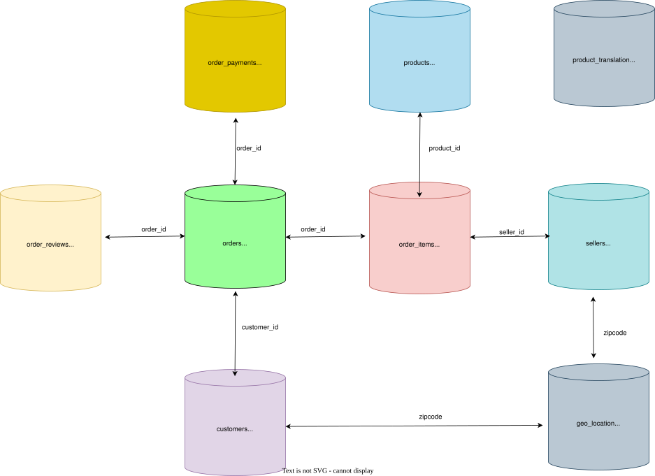

# **Olist Veritabanı Analizi**

**Kaggle notebook (aynı veri seti):** [Olist: p = 0 Is Not a Finding](https://www.kaggle.com/code/senanuretin/olist-p-0-is-not-a-finding) — üç klasik hipotez testinin etki büyüklükleriyle yeniden değerlendirilmesi.

### **Hakkında**

*`Olist` Brezilya'nın en büyük mağazası olup, Brezilya'nın her yerinden küçük işletmeleri birbirine bağlar.
Veri, Ekim 2016 ile Ekim 2018 arasındaki dönemden 100K sipariş içerir. Veritabanı siparişler, müşteriler, 
satıcılar, ödeme yöntemleri, ürünler ve konumlar hakkında bilgiler içerir.*

*Veri seti Kaggle'da bu [bağlantıda](https://www.kaggle.com/datasets/olistbr/brazilian-ecommerce?select=product_category_name_translation.csv) mevcuttur*

*Bu projede, önce veritabanını sıfırdan oluşturduk, ardından müşteri, satıcı ve siparişleri derinlemesine `analiz` ettik ve 
sipariş hacmi, teslimat süresi, değerli müşteri pazarları, gelir açısından önemli satıcılar vb. hakkında önemli `içgörüler` 
elde ettik ve `PostgreSQL` kullandık*

*Olist tarafından sağlanan dört ana veri kategorisinde analiz gerçekleştirdik*

|   **Analiz**|   **Markdown**|   **Notebook**|
|---|---|---|
|   Siparişlerin Sıklığı| [md](Frequency_analysis_of_orders/)   | [notebook](Frequency_analysis_of_orders/Frequency_analysis_of_orders.ipynb)  |
|   Müşteriler| [md](Customer_analysis)  | [notebook](Customer_analysis/Customer_analysis.ipynb)  |
|   Satıcılar|[md](Seller_analysis/)   | [notebook](Seller_analysis/Seller_analysis.ipynb)  |
|   Ürünler| [md](Product_analysis/)  |[notebook](Product_analysis/Product_Analysis.ipynb)|
|   Çeşitli| [md](Miscellaneous/)  |[notebook](Miscellaneous/Miscellaneous.ipynb)   |

### **Veritabanı Nasıl Kullanılır**

1. PostgreSQL ve pgAdmin4'ü yükleyin
2. Depoyu klonlayın
3. CSV dosyalarını [buradan](curl -L "https://d32aokrjazspmn.cloudfront.net/materials/olist.zip") indirin ve `olist_data/` klasörü içine açın
4. pgAdmin4'ü açın, Server > LOCAL öğesine gidin, sağ tıklayın ve CREATE'i seçin, veritabanı adını `olist` olarak girin
5. Olist veritabanına tekrar gidin, sağ tıklayın ve Query Tool'u açın
6. Klasör simgesine tıklayın, indirilen klasöre gidin ve `create_table.sql` dosyasını açın, tüm dosyayı seçin ve çalıştırın, bu gerekli tüm tabloları oluşturacaktır
7. Tekrar klasöre gidin ve `import_data.sql` dosyasını açın, tüm yolları bilgisayarınızdaki indirilen yolla değiştirin
8. Tüm kodu seçin ve çalıştırın, bu tüm verileri içe aktaracaktır
9. Sorgularla oynayın veya kendi analizinizi yapın

### **Analizler Nasıl Oluşturulur**
Başlamak için `Frequency_analysis_of_orders.ipynb` dosyasına bakarak ilham alabilirsiniz!
